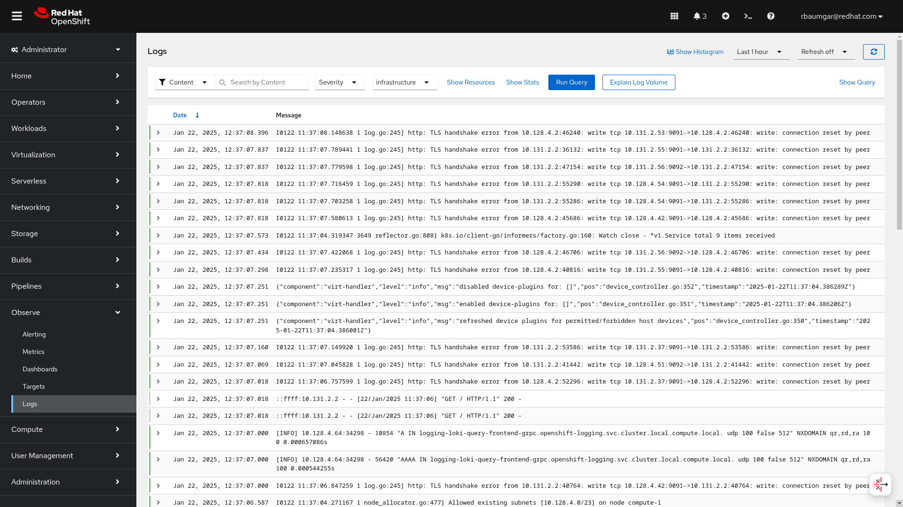
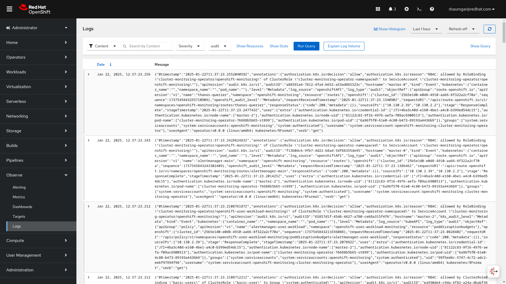
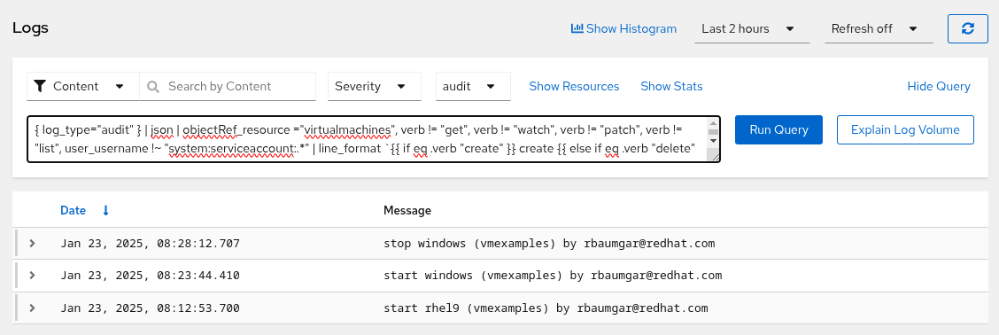
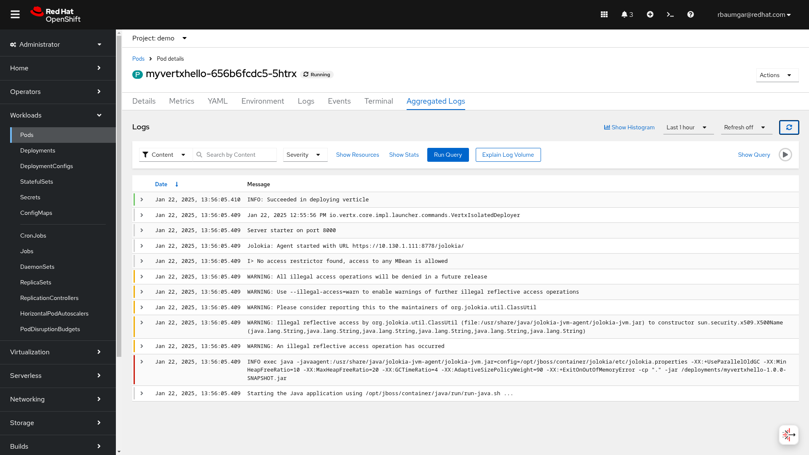
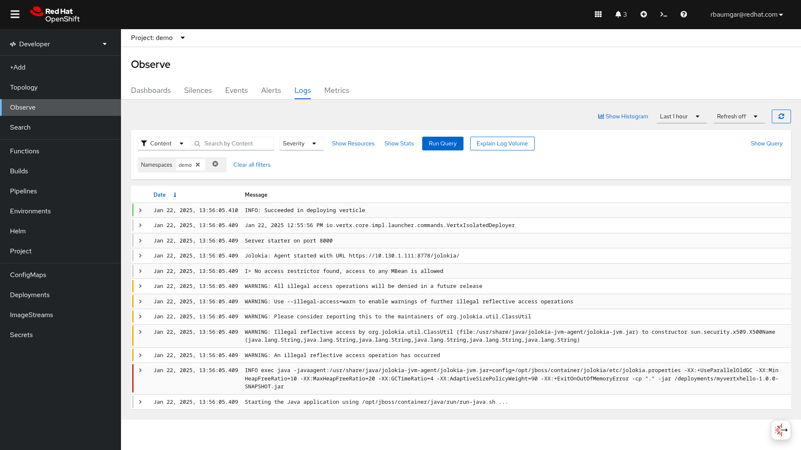
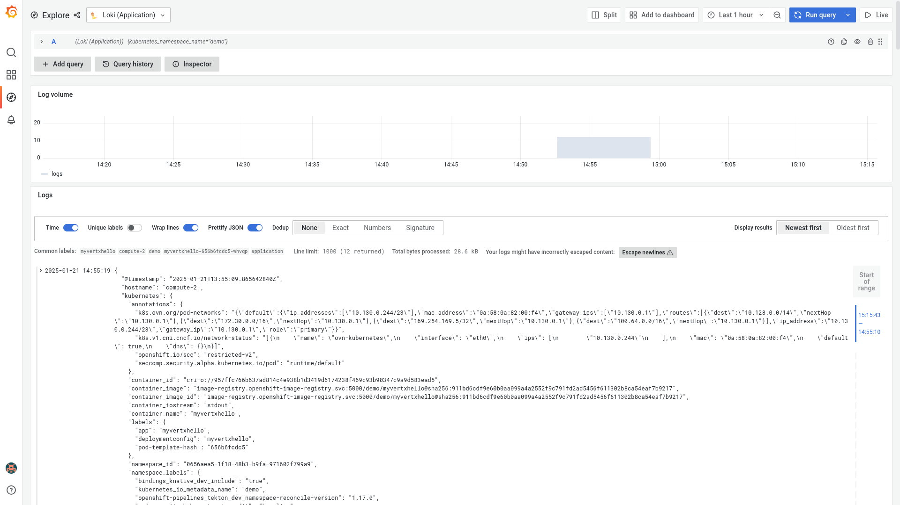

# OpenShift Logging QuickStart Guide with Loki


*By Robert Baumgartner, Red Hat Austria, Janurary 2025 (OpenShift 4.17, OpenShift Logging 6.1)*

In this blog, I will guide you on

- How to install Loki as storage for OpenShift Logging using MinIO as an object store

- How to install OpenShift Logging using the Loki stack

- How to install OpenShift console UIPlugin and use it

OpenShift Logging is a powerful and flexible logging solution for OpenShift, built on top of the Vector and Loki project. It provides a unified approach to collecting, aggregating, and analyzing logs from various sources within an OpenShift cluster, such as container images, cluster nodes, and the Kubernetes API server.

OpenShift Logging was based on the Elastic, Fluentd, and Kibana project in the previous version.

You need to be a cluster admin to follow this guide.

This document is based on OpenShift 4.17. See [Configuring and using logging in OpenShift Container Platform](https://docs.redhat.com/en/documentation/openshift_container_platform/4.17/html/logging/index).

## Install MinIO (optional)
Loki requires an object store. So if you already have an object store available you can skip this chapter.

### Create a New MinIO Project

Create a new project (for example minio) :

```shell
$ oc new-project minio
```

### Create the MinIO Objects

```shell
# create minio admin password
MINIO_ADMIN_PWD=`openssl rand -base64 12`
# cat minio/secret-minio.yaml
cat <<EOF | oc apply -f -
apiVersion: v1
kind: Secret
type: Opaque
metadata:
  annotations: {}
  name: minio-access-secrets
stringData:
  minioSecret: $MINIO_ADMIN_PWD
  minioAccessKey: minio
  minioConsoleAddress: ":44645"
EOF
secret/minio-access-secrets created

$ oc apply -f minio/pvc-minio.yaml
persistentvolumeclaim/minio-home-claim created
persistentvolumeclaim/minio-config-claim created

$ oc apply -f minio/svc-minio.yaml
service/minio created

$ oc apply -f minio/deployment-minio.yaml
deployment.apps/minio-server created

$ oc apply -f minio/route-minio.yaml
route.route.openshift.io/minio-console created
route.route.openshift.io/minio-server created

$ oc get pod -n minio
NAME                           READY   STATUS    RESTARTS   AGE
minio-server-cf8c6c9c4-cvwwv   1/1     Running   0          3d2h

$ oc logs deployments/minio-server -n minio
INFO: WARNING: MINIO_ACCESS_KEY and MINIO_SECRET_KEY are deprecated.
         Please use MINIO_ROOT_USER and MINIO_ROOT_PASSWORD
MinIO Object Storage Server
Copyright: 2015-2025 MinIO, Inc.
License: GNU AGPLv3 - https://www.gnu.org/licenses/agpl-3.0.html
Version: RELEASE.2024-12-18T13-15-44Z (go1.23.4 linux/amd64)

API: http://10.128.4.14:9000  http://127.0.0.1:9000 
WebUI: http://10.128.4.14:44645 http://127.0.0.1:44645   

Docs: https://docs.min.io
```

### Create a bucket and user for the Lokistack

```shell
# create loki user secret
LOKI_USER_SECRET=`openssl rand -base64 12`

# create an alias for the connection
$ oc rsh deployments/minio-server \
         mc alias set myminio http://localhost:9000 minio $MINIO_ADMIN_PWD
Added `myminio` successfully.

# copy policy file to pod
$ cat minio/openshift-logging-access-policy.json | \
  oc exec deployments/minio-server -i -- sh -c "cat /dev/stdin > /tmp/openshift-logging-access-policy.json"

# create new policy
$ oc rsh deployments/minio-server \
         mc admin policy create myminio openshift-logging-access-policy /tmp/openshift-logging-access-policy.json
Created policy `openshift-logging-access-policy` successfully.

# cleanup: remove policy file
$ oc rsh deployments/minio-server rm /tmp/openshift-logging-access-policy.json

# (optional) create list all policies
$ oc rsh deployments/minio-server \
         mc admin policy ls myminio
readonly
readwrite
writeonly
consoleAdmin
diagnostics
openshift-logging-access-policy

# create openshift-logging bucket
$ oc rsh deployments/minio-server \
         mc mb myminio/openshift-logging
Bucket created successfully `myminio/openshift-logging`.

# (optional) list all buckets
$ oc rsh deployments/minio-server \
         mc ls myminio
[2025-01-09 11:28:51 UTC]     0B openshift-logging/

# create user
$ oc rsh deployments/minio-server \
         mc admin user add myminio loki-user $LOKI_USER_SECRET
Added user `loki-user` successfully.

# (optional) list all users
$ oc rsh deployments/minio-server \
         mc admin user ls myminio
enabled    loki-user

# attach openshift-logging-acccess-policy to user openshift-logging
$ oc rsh deployments/minio-server \
         mc admin policy attach myminio openshift-logging-access-policy --user loki-user
Attached Policies: [openshift-logging-access-policy]
To User: openshift-logging

# (optional) if you want displays information on a MinIO server
$ oc rsh deployments/minio-server \
         mc admin info myminio
●  localhost:9000
   Uptime: 1 week 
   Version: 2024-12-18T13:15:44Z
   Network: 1/1 OK 
   Drives: 1/1 OK 
   Pool: 1

┌──────┬────────────────────────┬─────────────────────┬──────────────┐
│ Pool │ Drives Usage           │ Erasure stripe size │ Erasure sets │
│ 1st  │ 95.3% (total: 750 GiB) │ 1                   │ 1            │
└──────┴────────────────────────┴─────────────────────┴──────────────┘

16 GiB Used, 2 Buckets, 18,610 Objects
1 drive online, 0 drives offline, EC:0 

# cleanup: remove the alias for the connection
$ oc rsh deployments/minio-server \
         mc alias remove myminio
Removed `myminio` successfully.
```

You can log in to the MinIO console with minio/$MINIO_ADMIN_PWD

```shell
# get MinIO console URL
$ oc get route minio-console -o jsonpath='{.spec.host}'
minio-console-minio.apps.rbaumgar.demo.net
```

When you use the MinIO server as a general-purpose object storage (s3) you should keep in mind, that you assign to other users similar policies (openshift-logging-access-policy).
If you are using the default policies (readonly, readwrite and writeonly) those users can access all buckets on the server.

The configuration of the MinIO server is not HA. There is also a MinIO operator available.

Keep in mind if you have networkpolicies in use, allow the project openshift-logging access to the project minio on port 9000.

## Install Operators: OpenShift Logging, Loki, Observability Operator

Install the required operators

```sh
$ oc create -f operators/logging/operator-logging.yaml
namespace/openshift-logging created
operatorgroup.operators.coreos.com/openshift-logging-cqwll created
subscription.operators.coreos.com/cluster-logging created
```

```sh
$ oc create -f operators/loki/operator-loki.yaml
namespace/openshift-operators-redhat created
operatorgroup.operators.coreos.com/openshift-operators-redhat-mhrbh created
subscription.operators.coreos.com/loki-operator created
```

```sh
$ oc create -f operators/coo/operator-coo.yaml
subscription.operators.coreos.com/cluster-observability-operator created
```

Check that all operators are running and phase is *Succeeded*. This may take some minutes.

```sh
$ oc get csv -n openshift-logging cluster-logging.v6.1.0
NAME                      DISPLAY                     VERSION   REPLACES   PHASE
cluster-logging.v6.1.0    Red Hat OpenShift Logging   6.1.0                Succeeded

$ oc get csv -n openshift-operators-redhat loki-operator.v6.1.0
NAME                      DISPLAY                 VERSION   REPLACES   PHASE
loki-operator.v6.1.0      Loki Operator           6.1.0                Succeeded

$ oc get csv -n openshift-operators cluster-observability-operator.0.4.1 
NAME                                   DISPLAY                          VERSION   REPLACES                               PHASE
cluster-observability-operator.0.4.1   Cluster Observability Operator   0.4.1     cluster-observability-operator.0.3.2   Succeeded
```

## Configure the LokiStack 

Loki Operator supports AWS S3, Azure, GCS, MinIO, OpenShift Data Foundation, and Swift for the LokiStack object storage.

If you are using a different object store you might need to define the secret differently.
See https://github.com/grafana/loki/blob/main/operator/docs/lokistack/object_storage.md

```sh
$ kubectl create secret generic lokistack-minio -n openshift-logging\
          --from-literal=bucketnames="openshift-logging" \
          --from-literal=endpoint="http://minio.minio.svc:9000" \
          --from-literal=access_key_id="loki-user" \
          --from-literal=access_key_secret="$LOKI_USER_SECRET"
secret/lokistack-minio created
```

The endpoint consists= <svc>.<project>.svc:9000.

Loki supports different preconfigured sizes.

The `1x.demo` configuration defines a single Loki deployment with minimal resource and limit requirements, and no high availability (HA) support for all Loki components. This configuration is suited for a demo environment.

The `1x.pico` configuration defines a single Loki deployment with minimal resource and limit requirements, offering high availability (HA) support for all Loki components. This configuration is suited for deployments that do not require a single replication factor or auto-compaction.

Other available sizes are `1x.extra-small`, `1x.small`, and `1x.medium`.
See https://docs.redhat.com/en/documentation/openshift_container_platform/4.17/html-single/logging/index#log6x-loki-sizing_log6x-loki-6.1

In the operators/loki/lokistack.yaml the spec.size is defined as `1x.demo`. 

To save space the Lokistack retention period is set to 3 days. The maximum supported retention period is 30 days.

```sh
$ oc project openshift-logging

# find default storageclass
DEFAULt_STORAGECLASS=`kubectl get storageclasses.storage.k8s.io -o=jsonpath='{.items[?(@.metadata.annotations.storageclass\.kubernetes\.io/is-default-class=="true")].metadata.name}'`

$ cat <<EOF | oc apply -f -
apiVersion: loki.grafana.com/v1
kind: LokiStack
metadata:
  name: logging-loki
  namespace: openshift-logging
spec:
  tenants:
    mode: openshift-logging
  managementState: Managed
  limits:
    global:
      queries:
        queryTimeout: 3m
      retention:
        days: 3
  storage:
    schemas:
      - effectiveDate: '2024-10-11'
        version: v13
    secret:
      name: lokistack-minio
      type: s3
  hashRing:
    type: memberlist
  size: 1x.demo
  storageClassName: $DEFAULT_STORAGECLASS
  replicationFactor: 1
EOF
lokistack.loki.grafana.com/logging-loki created
```

Wait until all pods are running and the status of the CRD goes to ready.

```sh
$ oc get pod -l app.kubernetes.io/instance=logging-loki
NAME                                           READY   STATUS    RESTARTS   AGE
logging-loki-compactor-0                       1/1     Running   0          3d20h
logging-loki-distributor-55f9475cc6-jdhjb      1/1     Running   0          3d20h
logging-loki-gateway-778c49b997-dfzjc          2/2     Running   0          3d20h
logging-loki-gateway-778c49b997-k58v8          2/2     Running   0          3d20h
logging-loki-index-gateway-0                   1/1     Running   0          3d20h
logging-loki-ingester-0                        1/1     Running   0          3d20h
logging-loki-querier-55d7fbb758-222dw          1/1     Running   0          3d20h
logging-loki-query-frontend-754c4594c5-rmgww   1/1     Running   0          3d20h

$ oc get lokistacks.loki.grafana.com -o custom-columns=Status:status.conditions[0].message
Status
All components ready
```

If you select another size than 1x.demo multiple pods for the Lokistack will be created.

*LokiStack Components*
- Gateway: The gateway receives requests and redirects them to the appropriate container based on the request’s URL.
- Distributor: The distributor service is responsible for handling incoming streams by clients.
Ingester: The ingester service is responsible for writing log data to long-term storage backends (DynamoDB, S3, Cassandra, etc.) on the write path and returning log data for in-memory queries on the read path.
- Query Frontend:  internally performs some query adjustments and holds queries in an internal queue.
- Querier: handles queries using the LogQL query language, fetching logs both from the ingesters and from long-term storage.
- Compactor: a specific service that reduces the index size by deduping the index and merging all the files to a single file per table.
- Index Gateway: downloads and synchronizes the index from the Object Storage in order to serve index queries to the Queriers and Rulers over gRPC.

## Configure the ClusterLogForwarder to the Lokistack

```sh
$ oc create sa collector
serviceaccount/collector created

$ oc adm policy add-cluster-role-to-user cluster-logging-write-application-logs -z collector 
clusterrole.rbac.authorization.k8s.io/cluster-logging-write-application-logs added: "collector"

$ oc adm policy add-cluster-role-to-user cluster-logging-write-audit-logs -z collector
clusterrole.rbac.authorization.k8s.io/cluster-logging-write-audit-logs added: "collector"

$ oc adm policy add-cluster-role-to-user cluster-logging-write-infrastructure-logs -z collector
clusterrole.rbac.authorization.k8s.io/cluster-logging-write-infrastructure-logs added: "collector"

$ oc adm policy add-cluster-role-to-user collect-application-logs -z collector
clusterrole.rbac.authorization.k8s.io/collect-application-logs added: "collector"

$ oc adm policy add-cluster-role-to-user collect-audit-logs -z collector
clusterrole.rbac.authorization.k8s.io/collect-audit-logs added: "collector"

$ oc adm policy add-cluster-role-to-user collect-infrastructure-logs -z collector
clusterrole.rbac.authorization.k8s.io/collect-infrastructure-logs added: "collector"

$ oc apply -f operators/logging/clusterlogforwarder.yaml
clusterlogforwarder.observability.openshift.io/collector created
```

You only need to apply the required roles for your required log types (application, audit, and infrastructure).

```sh
$ oc get clusterlogforwarders.observability.openshift.io collector --template='{{printf "%-55s %7s %-30s\n" "Type" "Status" "Reason/Message"}}{{range .status.conditions}}{{printf "%-55s %7s %s/%s\n" .type .status .reason .message}}{{end}}'
Type                                                     Status Reason/Message                
observability.openshift.io/ValidLokistackOTLPOutputs       True ValidationSuccess/
observability.openshift.io/Authorized                      True ClusterRolesExist/permitted to collect log types: [application audit infrastructure]
observability.openshift.io/Valid                           True ValidationSuccess/
Ready                                                      True ReconciliationComplete/

# InputConditions
$ oc get clusterlogforwarders.observability.openshift.io collector --template='{{printf "%-55s %7s %-30s\n" "Type" "Status" "Reason/Message"}}{{range .status.inputConditions}}{{printf "%-55s %7s %s/%s\n" .type .status .reason .message}}{{end}}'
Type                                                     Status Reason/Message                
observability.openshift.io/ValidInput-application          True ValidationSuccess/input "application" is valid
observability.openshift.io/ValidInput-infrastructure       True ValidationSuccess/input "infrastructure" is valid
observability.openshift.io/ValidInput-audit                True ValidationSuccess/input "audit" is valid

# OutputConditions
$ oc get clusterlogforwarders.observability.openshift.io collector --template='{{printf "%-72s %7s %-30s\n" "Type" "Status" "Reason/Message"}}{{range .status.outputConditions}}{{printf "%-72s %7s %s/%s\n" .type .status .reason .message}}{{end}}'
Type                                                                      Status Reason/Message                
observability.openshift.io/ValidOutput-default-lokistack-application        True ValidationSuccess/output "default-lokistack-application" is valid
observability.openshift.io/ValidOutput-default-lokistack-audit              True ValidationSuccess/output "default-lokistack-audit" is valid
observability.openshift.io/ValidOutput-default-lokistack-infrastructure     True ValidationSuccess/output "default-lokistack-infrastructure" is valid

# PipelineCondition
$ oc get clusterlogforwarders.observability.openshift.io collector --template='{{printf "%-57s %7s %-30s\n" "Type" "Status" "Reason/Message"}}{{range .status.pipelineConditions}}{{printf "%-57s %7s %s/%s\n" .type .status .reason .message}}{{end}}'

$ oc get daemonsets.apps collector
NAME        DESIRED   CURRENT   READY   UP-TO-DATE   AVAILABLE   NODE SELECTOR            AGE
collector   6         6         6       6            6           kubernetes.io/os=linux   5d23h

$ oc get pod -l app.kubernetes.io/instance=collector
NAME              READY   STATUS    RESTARTS   AGE
collector-588b9   1/1     Running   0          3d19h
collector-88vc5   1/1     Running   0          3d19h
collector-bpj84   1/1     Running   0          3d19h
collector-fnbgr   1/1     Running   0          3d19h
collector-s858j   1/1     Running   0          3d19h
collector-scv4z   1/1     Running   0          3d19h
```

In this example, six collectors are running because one is on each node. 3 control plain nodes and 3 worker nodes.

## Install Cluster Observability Operator

The Cluster Observability Operator is required for the UI in the OpenShift console to display the log content.

```sh
$ oc apply -f operators/coo/uiplugin-logging.yaml
uiplugin.observability.openshift.io/logging created
```

Go to the OpenShift console and wait until the "refresh web console" pops up. Then the UIPlugin is available.


## View Logs as Cluster Admin 

As a user with admin rights you will find the logs under the `Administrator` menu and select `Observe / Logs`.

In the top row a selection for the
- content (search for a string within the log message)
- namespace
- pod
- container
- severity (critical, error, warning, debug, info, trace, and unknown)
- log type (application, infrastructure ,and audit)

On the top right is a selection of the time range and the refresh interval.

- Application logs:
Container logs are generated by user applications running in the cluster, except infrastructure container applications.


- Infrastructure logs:
Container logs generated by infrastructure namespaces: openshift*, kube*, or default, as well as journald messages from nodes.



- Audit logs:
Logs generated by auditd, the node audit system, which is stored in the /var/log/audit/audit.log file, and logs from the auditd, kube-apiserver, openshift-apiserver services, as well as the ovn project if enabled.



With the *Show Query* button you can create your query.

Some examples:

```
{ log_type="infrastructure", kubernetes_namespace_name="openshift-logging" } |= `grafana` | json
```
all log entries from the namespace `openshift-logging` with the content `grafana`

```
{ log_type="infrastructure"} |= \`Started crio\` | json | log_source="node" | hostname="master-0"
```
all log entries from the node log from the hostname `master-0` with the content `Started crio`

```
{ log_type="audit" } | json | objectRef_resource ="virtualmachines", verb != "get", verb != "watch", verb != "patch", verb != "list", user_username !~ "system:serviceaccount:.*" | line_format `{{ if eq .verb "create" }} create {{ else if eq .verb "delete" }} delete {{else}} {{ .objectRef_subresource }} {{end}} {{ .objectRef_name }} ({{ .objectRef_namespace  }}) by {{ .user_username  }}`
```
create a report who started, stopped or changed a Virtualmachin



Following labels are available at application and infrastructure log:
- kubernetes_container_name
- kubernetes_host
- kubernetes_namespace_name
- kubernetes_pod_name
- log_type

Following labels are available at audit log
- kubernetes_host
- log_type

You will find more details about Loki LoqQL [ Grafana Loki -> Query -> Log queries](https://grafana.com/docs/loki/latest/query/log_queries/)

## View Logs as User

As a user without admin rights, you will find the logs under the `Administrator` menu and select `Workloads / Pods`. When the pod is selected there is a tab `Aggregated Logs`



Another view is available under the `Developer` menu and select `Observe` and the `Logs` tab.



All messages in this namespace are displayed.

## (optional) Create Event Router

If you want to persist the events of the OpenShift platform you can use the Event Router.

The OpenShift Container Platform Event Router is a pod that watches Kubernetes events and logs them for collection by the logging. You must manually deploy the Event Router.

The Event Router collects events from all projects and writes them to STDOUT. The collector then forwards those events to the store defined in the ClusterLogForwarder custom resource (CR).

```sh
$ oc process -f eventrouter/eventrouter.yaml | oc apply -n openshift-logging -f -
serviceaccount/eventrouter created
clusterrole.rbac.authorization.k8s.io/event-reader created
clusterrolebinding.rbac.authorization.k8s.io/event-reader-binding created
configmap/eventrouter created
deployment.apps/eventrouter created
```

More details can be found [Collecting and storing Kubernetes events](https://docs.redhat.com/en/documentation/openshift_container_platform/4.16/html-single/logging/index#cluster-logging-eventrouter). Currently it is missing in 4.17 documentation, but it is working as designed.

View the new Event Router pod:

```sh
$ oc get pods --selector  component=eventrouter -o name -n openshift-logging
pod/eventrouter-549f95c7d7-6fqqx
```

View the events collected by the Event Router:

```sh
$ oc logs deploy/eventrouter -n openshift-logging
{"verb":"ADDED","event":{"metadata":{"name":"redhat-operators-w8svm.1818dc6c594723df","namespace":"openshift-marketplace","uid":"6ba1e49b-082d-4e3d-a700-a9bcba9689b6","resourceVersion":"2810786987","creationTimestamp":"2025-01-08T23:46:54Z","managedFields":[{"manager":"kubelet","operation":"Update","apiVersion":"v1","time":"2025-01-08T23:46:54Z","fieldsType":"FieldsV1","fieldsV1":{"f:count":{},"f:firstTimestamp":{},"f:involvedObject":{},"f:lastTimestamp":{},"f:message":{},"f:reason":{},"f:reportingComponent":{},"f:reportingInstance":{},"f:source":{"f:component":{},"f:host":{}},"f:type":{}}}]},"involvedObject":{"kind":"Pod","namespace":"openshift-marketplace","name":"redhat-operators-w8svm","uid":"5f618733-bea2-422d-985f-00cd0afe18a1","apiVersion":"v1","resourceVersion":"2810786706","fieldPath":"spec.containers{registry-server}"},"reason":"Created","message":"Created container registry-server","source":{"component":"kubelet","host":"master-0"},"firstTimestamp":"2025-01-08T23:46:54Z","lastTimestamp":"2025-01-08T23:46:54Z","count":1,"type":"Normal","eventTime":null,"reportingComponent":"kubelet","reportingInstance":"master-0"}}
```

### View the collected events in the console

Got to the Administrator view and select `infrastructure` and the pod `eventrouter-xxxx`.

### Uninstall the Event Router

```sh
$ oc delete deployment, sa, cm eventrouter
deployment.apps "eventrouter" deleted
serviceaccount "eventrouter" deleted
configmap "eventrouter" deleted

$ oc delete clusterrolebinding event-reader-binding
clusterrolebinding.rbac.authorization.k8s.io "event-reader-binding" deleted
$ oc delete clusterrole event-reader 
clusterrole.rbac.authorization.k8s.io "event-reader" deleted
```

## Access the Loki data with a Grafana dashboard

The preferred option for accessing the data stored in Loki managed by loki-operator when running on OpenShift with the default OpenShift tenancy model is to go through the LokiStack gateway and do proper authentication against the authentication service included in OpenShift.

The configuration uses oauth-proxy to authenticate the user to the Grafana instance and forwards the token through Grafana to LokiStack’s gateway service. This enables the configuration to fully take advantage of the tenancy model, so that users can only see the logs of their applications and only admins can view infrastructure and audit logs.

As the open-source version of Grafana does not support to limit datasources to certain groups of users, all datasources (“application”, “infrastructure” and “audit”) will be visible to all users. The infrastructure and audit datasources will not yield any data for non-admin users.

Keep in mind that the configuration points to the Loki Gateway server (GATEWAY_ADDRESS). This contains the Lokistack name (logging-loki). If you have changed, replace it with the correct name.

Deploy the Grafana server

```shell
$ oc apply -f grafana/grafana_gateway_ocp_oauth.yaml
serviceaccount/grafana created
clusterrolebinding.rbac.authorization.k8s.io/logging-grafana-auth-delegator created
configmap/grafana-config created
configmap/grafana-datasources created
service/grafana created
deployment.apps/grafana created
route.route.openshift.io/grafana created
```

Go to the Grafana route and login with an OpenShift user.

```shell
# get Grafana URL
$ oc get route grafana -o jsonpath='{.spec.host}'
grafana-openshift-logging.apps.rbaumgar.demo.net
```



### Uninstall Grafana

```sh
$ oc delete deployment,svc,route grafana
deployment.apps "grafana" deleted
service "grafana" deleted
route.route.openshift.io "grafana" deleted

$ oc delete cm grafana-config grafana-datasources
configmap "grafana-config" deleted
configmap "grafana-datasources" deleted

$ oc delete sa grafana
serviceaccount "grafana" deleted

$ oc delete ClusterRoleBinding logging-grafana-auth-delegator
clusterrolebinding.rbac.authorization.k8s.io "logging-grafana-auth-delegator" deleted
```

## Uninstall Logging Stack

```sh
$ oc projct openshift-logging

# Observability Operator
$ oc delete uiplugins.observability.openshift.io logging
uiplugin.observability.openshift.io "logging" deleted

# if no other UIPlugin is installed delete operator
$ oc delete subscriptions.operators.coreos.com -n openshift-operators cluster-observability-operator 
subscription.operators.coreos.com "cluster-observability-operator" deleted

$ oc delete csv -n openshift-operators cluster-observability-operator.0.4.1
clusterserviceversion.operators.coreos.com "cluster-observability-operator.0.4.1" deleted

$ oc delete crd uiplugins.observability.openshift.io
customresourcedefinition.apiextensions.k8s.io "uiplugins.observability.openshift.io" deleted

# OpenShift Logging Operator

$ oc delete clusterlogforwarders.observability.openshift.io collector
clusterlogforwarder.observability.openshift.io "collector" deleted

$ oc delete subscriptions.operators.coreos.com cluster-logging
subscription.operators.coreos.com "cluster-logging" deleted

$ oc delete csv cluster-logging.v6.1.0
clusterserviceversion.operators.coreos.com "cluster-logging.v6.1.0" deleted

$ oc delete crd logfilemetricexporters.logging.openshift.io \
                clusterlogforwarders.observability.openshift.io
customresourcedefinition.apiextensions.k8s.io "logfilemetricexporters.logging.openshift.io" deleted
customresourcedefinition.apiextensions.k8s.io "clusterlogforwarders.observability.openshift.io" deleted

# Loki Operator
$ oc delete lokistacks.loki.grafana.com logging-loki
lokistack.loki.grafana.com "logging-loki" deleted

$ oc delete subscriptions.operators.coreos.com -n openshift-operators-redhat loki-operator
subscription.operators.coreos.com "loki-operator" deleted

$ oc delete csv -n openshift-operators-redhat loki-operator.v6.1.0 
clusterserviceversion.operators.coreos.com "loki-operator.v6.1.0" deleted

$ oc delete pvc -l app.kubernetes.io/instance=logging-loki
persistentvolumeclaim "storage-logging-loki-compactor-0" deleted
persistentvolumeclaim "storage-logging-loki-index-gateway-0" deleted
persistentvolumeclaim "storage-logging-loki-ingester-0" deleted
persistentvolumeclaim "wal-logging-loki-ingester-0" deleted

$ oc delete crd alertingrules.loki.grafana.com \
                lokistacks.loki.grafana.com \
                recordingrules.loki.grafana.com \
                rulerconfigs.loki.grafana.com
customresourcedefinition.apiextensions.k8s.io "alertingrules.loki.grafana.com" deleted
customresourcedefinition.apiextensions.k8s.io "lokistacks.loki.grafana.com" deleted
customresourcedefinition.apiextensions.k8s.io "recordingrules.loki.grafana.com" deleted
customresourcedefinition.apiextensions.k8s.io "rulerconfigs.loki.grafana.com" deleted
```

## PodDisruptionBudget

When you install the Loki stack with the `1x.demo` size you will get PodDisruptionBuget definition. But all pods are at the minimum availability.

```sh
$ oc get pdb -l app.kubernetes.io/instance=logging-loki 
NAME                          MIN AVAILABLE   MAX UNAVAILABLE   ALLOWED DISRUPTIONS   AGE
logging-loki-compactor        1               N/A               0                     4d17h
logging-loki-distributor      1               N/A               0                     4d17h
logging-loki-gateway          1               N/A               1                     4d17h
logging-loki-index-gateway    1               N/A               0                     4d17h
logging-loki-ingester         1               N/A               0                     4d17h
logging-loki-querier          1               N/A               0                     4d17h
logging-loki-query-frontend   1               N/A               0                     4d17h
```

see **Not able to drain a node when running LokiStack with size 1x.demo in RHOCP 4**, https://access.redhat.com/solutions/7058851

As a workaround just delete the pdbs.

```shell
$ oc delete pdb -l app.kubernetes.io/instance=logging-loki
poddisruptionbudget.policy "logging-loki-distributor" deleted
poddisruptionbudget.policy "logging-loki-gateway" deleted
poddisruptionbudget.policy "logging-loki-index-gateway" deleted
poddisruptionbudget.policy "logging-loki-ingester" deleted
poddisruptionbudget.policy "logging-loki-querier" deleted
poddisruptionbudget.policy "logging-loki-query-frontend" deleted
```

This document: 
**[Github: rbaumgar/openshift-logging](https://github.com/rbaumgar/openshift-logging/blob/main/README.md)**
